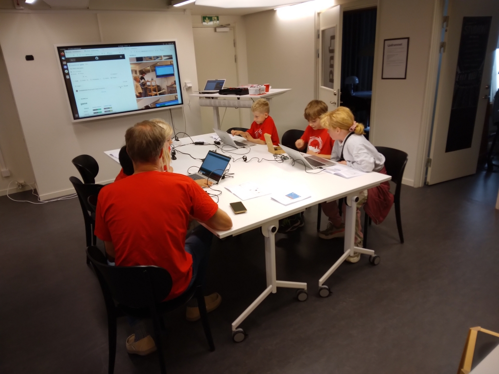
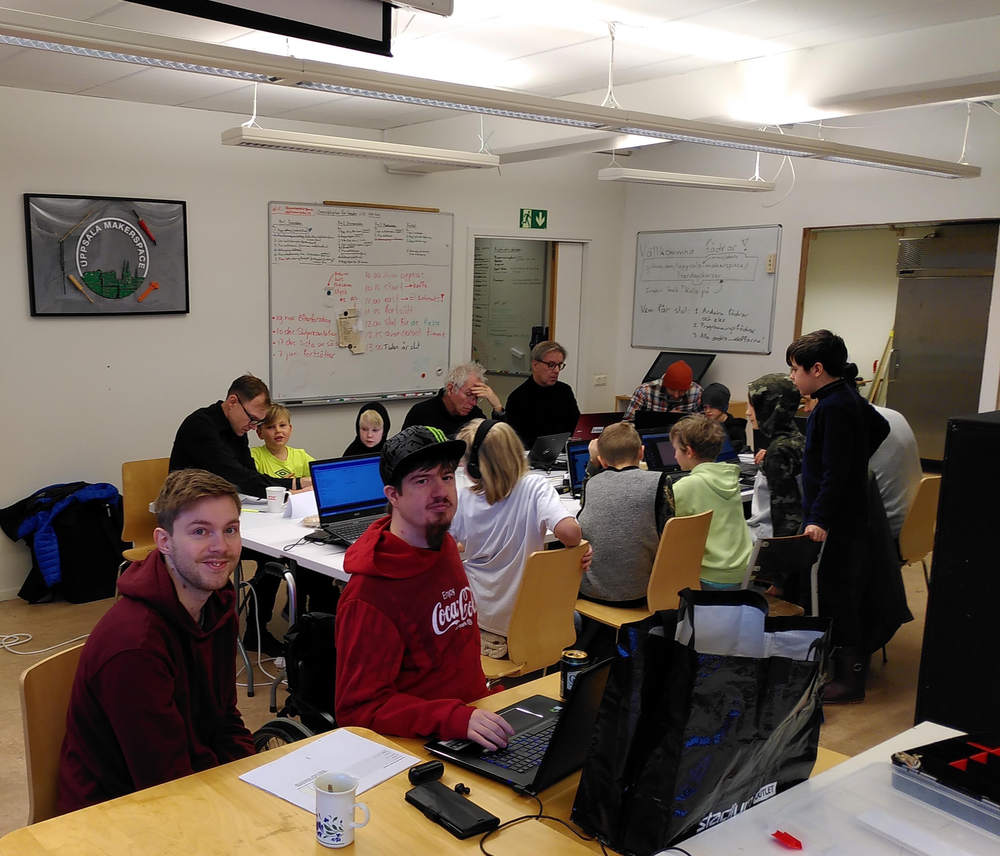
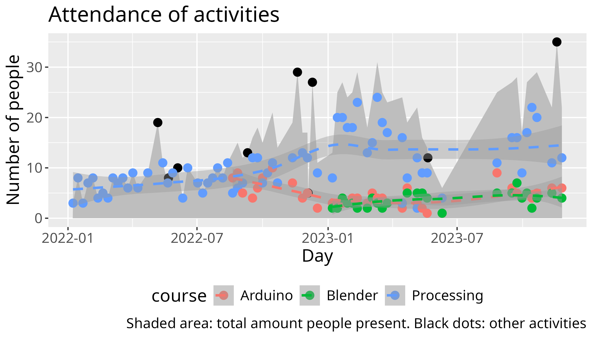

# Kick-off

I lead the Saturday courses.
I will share why I think these are important.
Maybe you think it is a good cause too.
For those, I will tell who can contribute on any voluntary basis.

## Pictures

> A course presentation, twice a year

> A quiet start of Kulturnatten.
> At the end of the day, we'd have had around 100 guests being taught!

> Efterfarsdag, where the kids teach dads

## Course goals

- Providing a learning community:
    - learning how to do 3D modeling, electronics, programming, teaching, shape a learning community
    - making the mistakes needed in a safe environment
- Providing a first/second home
- Make the world a better place locally
    - make the next generation awesome

## My role

- let the other volunteers do their thing
- end responsible
- maintain order
- administration
- organizing: student presentation, anonymous evaluations, Efterfarsdag/Eftermorsdag, Kulturnatten
- scheduling, make flyers, distribute flyers
- communication with parents, UMS, Stadsbiblioteket, etc.
- talk to other volunteers, parents, other guests
- prepare teaching materials
- teach

## Course core ideas

- students do everything themselves, no leaning on volunteers
- students help students
- students can be themselves when not disturbing others
- parents are always welcome, yet discouraged to be present
- teachers are students too

## Course success

> The number of participants per course, with 1146 visits in total.
> On April 1st 2023 we had to split up in two groups

> The effect the course may have on the Uppsala Makerspace.
> First vertical line: start of course
> Second vertical line: minors need a family membership

## Contributing

We could always use:

- adult students
- teachers
- host/hostess
- course leader

Because:

- *student*: being an adult that follows the course already helps the course to go more smoothly. Students help each other.
  We know the kids enjoy adults from our anonymous evaluations. As an adult students, you'll make the course go more smoothly
- *teacher*: answer questions, helping to make our students autonomous learners by coaching, 1-on-1 teaching is the exception. There are
  multiple teachers and they rotate in who works when.
  As a teacher, you'll make the course be able to go deeper
- *host/hostess/trivsel/wellbeing*: students need to to be welcomed when they come and sign up on a list. They need lemonade in the breaks.
  They may need to lie down on a sofa when ill. They need to have someone to talk to when upset. As a host/hostess, you'll help the students feel more at home
- *course leader*: we teach three courses, all involving a computer. If you too think there should be more different courses
  and you'd enjoy to profit from the Lördagskurser, you're welcome to add a new course to the Lördagskurser.
  You will have full autonomy, all I need to know is how to work together.
  As a course leader, you'll increase the diversity of the student population
  
