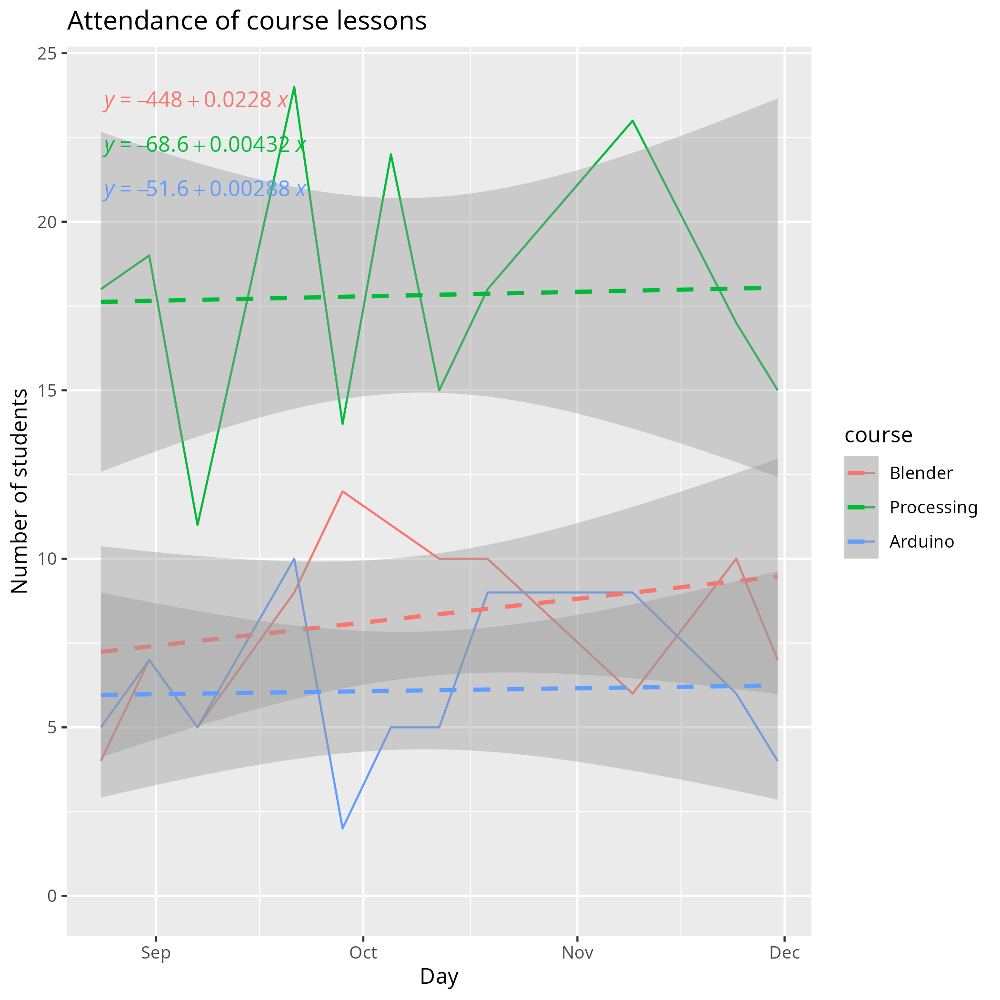
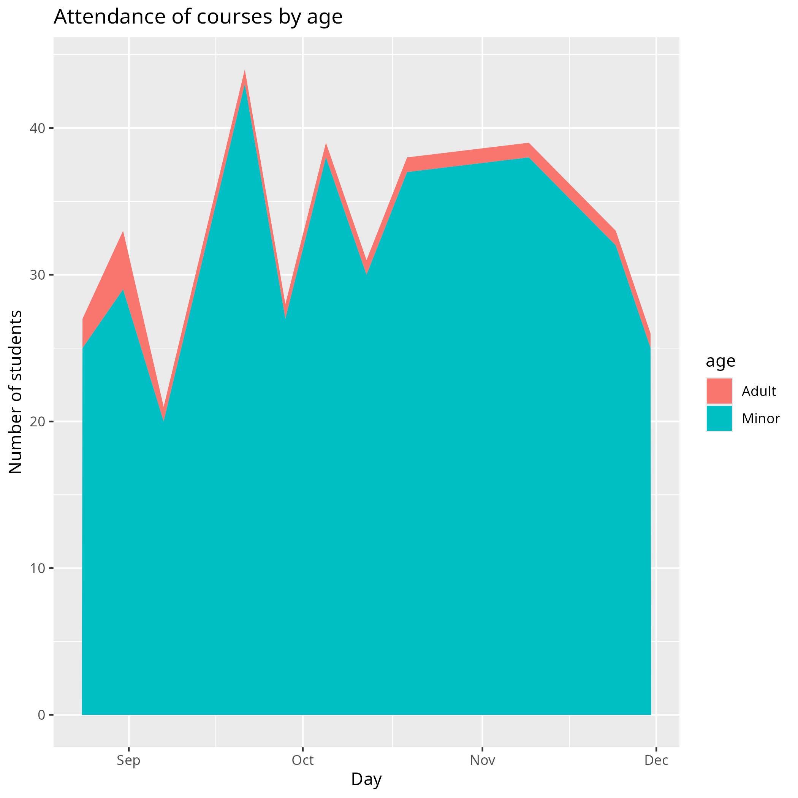

# Reflection 2024-12-08 by Richel

Looking back at the year,
first I start with some statistics.

## Reflection

Most of the things in this season remained the same:
I coordinate the course and Store Björn leads the Blender
course. We are helped by our experienced volunteers such
as Christoffer, Janne, Leslie, Ludvig and Mathias.
There were/are also some newer ones that sometimes
show us, which are Bogdan and Saw. 

Store Björn has been pivotal in all practical matters,
from transporting stuff or arranging to get equipment.
Without him, the courses would be so much heavier.

The other volunteers make a big difference: when they are
not there, I sometimes have queues of five learners that need
help. Maybe I should set up the course differently to prevent
these long queues, yet I know for sure that the other volunteers
allow the course to have a longer and more technically conversation
with our learners.

I am especially happy to have some volunteers
that are crazy enough to help out at the last
moment. One example is Store Björn helping at the start of
the Processing course when I have no volunteer there.
Another example is Mathias that hops in last-minute to either
help out at Processing or doing the reception desk.

I still regularily ask volunteers on how to improve the course.
Most of the time, there is no clear idea on how to do so,
because things seem to go well. We do discuss the course
and we do make little changes.

When there were too few volunteers, I sometimes asked parents
to help out. I am grateful to have their help too when I need to.

Besides the volunteers, the Uppsala Makerspace board has always
been helpful, also in cleaning the Space the day before.
They definitely make the Space a nice place to work.

A small change was in the course fee payment procedure.
There was a procedure that half-ass worked, that got
removed without notice. Here, the board and a member
helped out in setting up a new procedure, with a QR code
specifically for the Lördagskurser.

The biggest change in room setup is to add a reception desk
at the entrance. This worked out great: it greatly improved the
peace and quite in the classroom, because the learners get all
the admin done at the reception desk. From there onwards,
they can directly start to work. 

The most important new contribution is from a new volunteer
that we call 'AtomBjörn', who mans the reception desk.
Not only does the reception desk make the classroom more
quiet, it is also the place for new learners to have their
questions answered. Additionally, when the doorbell is not
ringing, AtomBjörn talks to everyone around and helps make
the atmosphere even more welcome.

Due to the reception desk, there is a bit more time for me to
talk to parents. I still know most parents by name
and I have a good relation with all of them.
All parents understand that I will immediately break
of a conversion when a learner has a question.
I am grateful to have such understanding parents in the courses.

I was afraid several times that the number of learners
would exceed 30, but looking at the course statistics below,
this fear seems unneeded.

I've been unnecessily snappy twice.
In both instances, this was when there were too few other
volunteers. Once I snapped to a parent that was helping,
but elaborated too much on technical matters,
while I was having a queue that was getting too long
to remember. I said sorry to the parent and he accepted.
The second occassion was to a learner that made a remark
of me writing code: (from Swedish) 'but you say you never
write code for us for our presentation!'. The kid was right
that ideally we don't write code for our learners, but also here,
I was trying to work through the queue of questions.
So, in both cases, I was snappy due to a queue that was too long.

Efterfarsdag went great! One luxury problem is that the
Processin course had 29 learners (when including the parents).
I will need to ask the UMS board to be exempted from the
30 person limit for Eftermorsdag.

- [ ] Ask UMS for +30 person limit on Eftermorsdag

Hackathon went okay. At the first two hours, I was alone.
This made the atmosphere a little more fuzzy and disorderly
than earlier hackathons. In the last hour, however, there was
still a reasonably, yet vivid, working atmosphere.

Doing the final presentation with two computers (instead
of one) was a suggestion of Store Björn that worked great.
It reduced the preparation time at Stadsbiblioteket, although
it still took 45 minutes to prepare (for 22 presentations).

The final presentation itself worked great. 
In total, it took 60 minutes (for 22 presentations).
When a presentation was
too short, I asked to discuss a favorite line of code or took
questions from the audience. There were, however, some learners
that took more questions than just one, which was disruptive.
I will make it into a rule to have zero or one questions

- [ ] Presentation rule: zero or one questions

I was unhappy with how the course evaluations packed out.
The course evaluations started at 12:50, 10 minutes before
the end. Most learners were already/still going home at 12:50,
so there was no peace and quiet. Learners filled in the evaluation
form on the go, while rushed.

A better moment to do evaluations is during the preparation of
the room: it is when parents are waiting anyways. We did
prepare a presentation there (and I have no idea how that went, as of now).
Also, maybe let the learners fill in the evaluation form during the
preparation (e.g. the second half of the presentations can do this at the
start, where the first half does so when all having been set up).

- [ ] No evaluations after presentation. Instead, do parent evaluations
  during preparing the main room. Let learners fill in form during preparations
  too

The biggest fixable problem is the lack of computers. I hope the
UMS board will buy 5 (second-hand) laptops, so that the learners can
work properly.

Taking a look at the evaluations that were filled in (see below),
we see that only 14 out of ~27 learners filled it in,
probably because there was no proper time allocated to it.
Most learners are happy, which is reasonable: it is only the
happy learners that stay :-) . I enjoy to read that 3 want
more advanced books and 3 others want more lessons.
More advanced books will be hard to do, due to my limited
time. More lessons will be hard, due to my limited time
and amount of volunteers. One learners stated there should be
more space, which is hard, as we are with a rather big group.

All in all, I think I can be reasonably happy with how the
course is going. I am, however, grateful to have such
friendly learners, helpful volunteers and understanding parents.

## Course statistics

The courses are growing:


If we split this up per course, each of the courses is growing:



It seems that:

Course    |Growth in this season
----------|------
Arduino   |+1
Blender   |+4
Processing|+1

It seems we'll be safe from crossing the 30 person maximum limit
for some time :-) .

If we look at the percentage of minors/adults,
the minors remain the majority:



If we look at the percentage of male/females,
the mals remain in the majority:


## Evaluation results

Taking a look [at the evaluation results](../../data/utvaerderingar/20241207/README.md),
there were 14 evaluation forms being filled in (for ~27 learners,
due to no time after presentation).

6x no suggestion for improvement:

```text
Kommer inte på något
Vet inte
No thing
Bra
Nothing it's perfect
Det finns inget enligt mig som kan förbättras
```

3x more books:

```text
More game making in Processing books
Jag tycker att kursen kan bli bättre om vu kunde ha längre lektioner, svårare böcker och mera kurser som vi kan välja ifrån
Fler böcker som är mer avancerade och komplicerade
```

3x more lessons:

```text
Fler lektioner i väckan
Jag tycker att kursen kan bli bättre om vu kunde ha längre lektioner, svårare böcker och mera kurser som vi kan välja ifrån
Jag trot kurserna är för korta
```

3x others:

```text
Kanske programmering av Minecraft moddar
Bättre rum där man jobbar
Får mer rolig tid, tex spela mer
```
